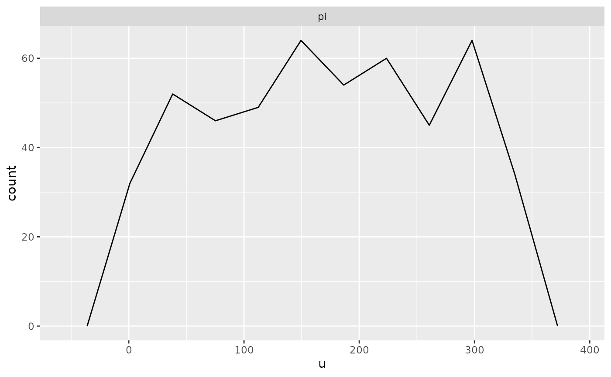

# Simulation Based Calibration

Here is a Stan program for a beta-binomial model

``` stan
data {
  int<lower = 1> N;
  real<lower = 0> a;
  real<lower = 0> b;
}
transformed data { // these adhere to the conventions above
  real pi_ = beta_rng(a, b);
  int y = binomial_rng(N, pi_);
}
parameters {
  real<lower = 0, upper = 1> pi;
}
model {
  target += beta_lpdf(pi | a, b);
  target += binomial_lpmf(y | N, pi);
}
generated quantities { // these adhere to the conventions above
  int y_ = y;
  vector[1] pars_;
  int ranks_[1] = {pi > pi_};
  vector[N] log_lik;
  pars_[1] = pi_;
  for (n in 1:y) log_lik[n] = bernoulli_lpmf(1 | pi);
  for (n in (y + 1):N) log_lik[n] = bernoulli_lpmf(0 | pi);
}
```

Notice that it adheres to the following conventions:

- Realizations of the unknown parameters are drawn in the
  `transformed data` block are postfixed with an underscore, such as
  `pi_`. These are considered the “true” parameters being estimated by
  the corresponding symbol declared in the `parameters` block, which
  have the same names except for the trailing underscore, such as `pi`.
- The realizations of the unknown parameters are then conditioned on
  when drawing from the prior predictive distribution in
  `transformed data` block, which in this case is
  `int y = binomial_rng(N, pi_);`. To avoid confusion, `y` does not have
  a training underscore.
- The realizations of the unknown parameters are copied into a `vector`
  in the `generated quantities` block named `pars_`
- The realizations from the prior predictive distribution are copied
  into an object (of the same type) in the `generated quantities` block
  named \`y\_. This is optional.
- The `generated quantities` block contains an integer array named
  `ranks_` whose only values are zero or one, depending on whether the
  realization of a parameter from the posterior distribution exceeds the
  corresponding “true” realization, which in this case is
  `ranks_[1] = {pi > pi_};`. These are not actually “ranks” but can be
  used afterwards to reconstruct (thinned) ranks.
- The `generated quantities` block contains a vector named `log_lik`
  whose values are the contribution to the log-likelihood by each
  observation. In this case, the “observations” are the implicit
  successes and failures that are aggregated into a binomial likelihood.
  This is optional but facilitates calculating the Pareto k shape
  parameter estimates that indicate whether the posterior distribution
  is sensitive to particular observations.

Assuming the above is compile to a code `stanmodel` named
`beta_binomial`, we can then call the `sbc` function

``` r

output <- sbc(beta_binomial, data = list(N = 10, a = 1, b = 1), M = 500, refresh = 0)
```

At which point, we can then call

``` r

print(output)
```

    ## 0 chains had divergent transitions after warmup

``` r

plot(output, bins = 10) # it is best to specify the bins argument yourself
```



## References

Talts, S., Betancourt, M., Simpson, D., Vehtari, A., and Gelman, A.
(2018). Validating Bayesian Inference Algorithms with Simulation-Based
Calibration. [arXiv preprint
arXiv:1804.06788](https://arxiv.org/abs/1804.06788)
