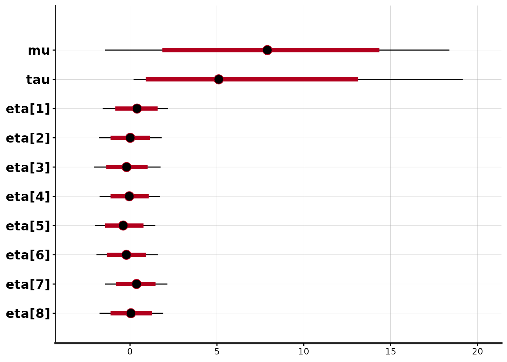
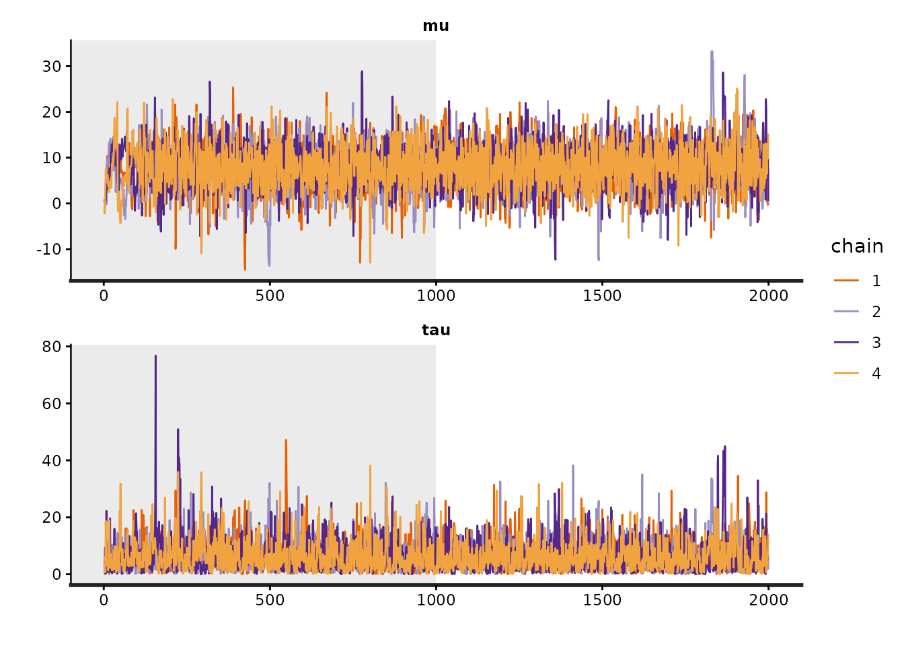
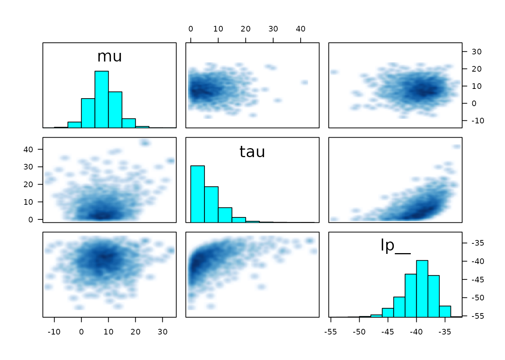

# RStan: the R interface to Stan

In this vignette we present RStan, the R interface to Stan. Stan is a
C++ library for Bayesian inference using the No-U-Turn sampler (a
variant of Hamiltonian Monte Carlo) or frequentist inference via
optimization. We illustrate the features of RStan through an example in
Gelman et al. (2003).

## Introduction

Stan is a C++ library for Bayesian modeling and inference that primarily
uses the No-U-Turn sampler (NUTS) (Hoffman and Gelman 2012) to obtain
posterior simulations given a user-specified model and data.
Alternatively, Stan can utilize the LBFGS optimization algorithm to
maximize an objective function, such as a log-likelihood. The R package
**rstan** provides RStan, the R interface to Stan. The **rstan** package
allows one to conveniently fit Stan models from R (R Core Team 2014) and
access the output, including posterior inferences and intermediate
quantities such as evaluations of the log posterior density and its
gradients.

In this vignette we provide a concise introduction to the functionality
included in the **rstan** package. Stan’s website
[mc-stan.org](https://mc-stan.org) has additional details and provides
up-to-date information about how to operate both Stan and its many
interfaces including RStan. See, for example, *RStan Getting Started*
(The Stan Development Team 2014).

## Prerequisites

Stan has a modeling language, which is similar to but not identical to
that of the Bayesian graphical modeling package BUGS (Lunn et al. 2000).
A parser translates a model expressed in the Stan language to C++ code,
whereupon it is compiled to an executable program and loaded as a
Dynamic Shared Object (DSO) in R which can then be called by the user.

A C++ compiler, such as [`g++`](https://gcc.gnu.org) or
[`clang++`](https://clang.llvm.org), is required for this process. For
instructions on installing a C++ compiler for use with RStan see
[RStan-Getting-Started](https://github.com/stan-dev/rstan/wiki/RStan-Getting-Started).

The **rstan** package also depends heavily on several other R packages:

- **StanHeaders** (Stan C++ headers)
- **BH** (Boost C++ headers)
- **RcppEigen** (Eigen C++ headers)
- **Rcpp** (facilitates using C++ from R)
- **inline** (compiles C++ for use with R)

These dependencies should be automatically installed if you install the
**rstan** package via one of the conventional mechanisms.

## Typical Workflow

The following is a typical workflow for using Stan via RStan for
Bayesian inference.

1.  Represent a statistical model by writing its log posterior density
    (up to an normalizing constant that does not depend on the unknown
    parameters in the model) using the Stan modeling language. We
    recommend using a separate file with a `.stan` extension, although
    it can also be done using a character string within R.
2.  Translate the Stan program to C++ code using the `stanc` function.
3.  Compile the C++ code to create a DSO (also called a dynamic link
    library (DLL)) that can be loaded by R.
4.  Run the DSO to sample from the posterior distribution.
5.  Diagnose non-convergence of the MCMC chains.
6.  Conduct inference based on the posterior sample (the MCMC draws from
    the posterior distribution).

Conveniently, steps 2, 3, and 4, above, are all performed implicitly by
a single call to the `stan` function.

## Example

Throughout the rest of the vignette we’ll use a hierarchical
meta-analysis model described in section 5.5 of Gelman et al. (2003) as
a running example. A hierarchical model is used to model the effect of
coaching programs on college admissions tests. The data, shown in the
table below, summarize the results of experiments conducted in eight
high schools, with an estimated standard error for each. These data and
model are of historical interest as an example of full Bayesian
inference (Rubin 1981). For short, we call this the *Eight Schools*
examples.

| School | Estimate (\\y_j\\) | Standard Error (\\\sigma_j\\) |
|--------|--------------------|-------------------------------|
| A      | 28                 | 15                            |
| B      | 8                  | 10                            |
| C      | -3                 | 16                            |
| D      | 7                  | 11                            |
| E      | -1                 | 9                             |
| F      | 1                  | 11                            |
| G      | 18                 | 10                            |
| H      | 12                 | 18                            |

We use the Eight Schools example here because it is simple but also
represents a nontrivial Markov chain simulation problem in that there is
dependence between the parameters of original interest in the study —
the effects of coaching in each of the eight schools — and the
hyperparameter representing the variation of these effects in the
modeled population. Certain implementations of a Gibbs sampler or a
Hamiltonian Monte Carlo sampler can be slow to converge in this example.

The statistical model of interest is specified as

\\ \begin{aligned} y_j &\sim \mathsf{Normal}(\theta_j, \sigma_j), \quad
j=1,\ldots,8 \\ \theta_j &\sim \mathsf{Normal}(\mu, \tau), \quad
j=1,\ldots,8 \\ p(\mu, \tau) &\propto 1, \end{aligned} \\

where each \\\sigma_j\\ is assumed known.

### Write a Stan Program

RStan allows a Stan program to be coded in a text file (typically with
suffix `.stan`) or in a R character vector (of length one). We put the
following code for the Eight Schools model into the file `schools.stan`:

    data {
      int<lower=0> J;          // number of schools
      array[J] real y;               // estimated treatment effects
      array[J] real<lower=0> sigma;  // s.e. of effect estimates
    }
    parameters {
      real mu;
      real<lower=0> tau;
      vector[J] eta;
    }
    transformed parameters {
      vector[J] theta;
      theta = mu + tau * eta;
    }
    model {
      target += normal_lpdf(eta | 0, 1);
      target += normal_lpdf(y | theta, sigma);
    }

The first section of the Stan program above, the `data` block, specifies
the data that is conditioned upon in Bayes Rule: the number of schools,
\\J\\, the vector of estimates, \\(y_1, \ldots, y_J)\\, and the vector
of standard errors of the estimates \\(\sigma\_{1}, \ldots,
\sigma\_{J})\\. Data are declared as integer or real and can be vectors
(or, more generally, arrays) if dimensions are specified. Data can also
be constrained; for example, in the above model \\J\\ has been
restricted to be at least \\1\\ and the components of \\\sigma_y\\ must
all be positive.

The `parameters` block declares the parameters whose posterior
distribution is sought. These are the the mean, \\\mu\\, and standard
deviation, \\\tau\\, of the school effects, plus the *standardized*
school-level effects \\\eta\\. In this model, we let the unstandardized
school-level effects, \\\theta\\, be a transformed parameter constructed
by scaling the standardized effects by \\\tau\\ and shifting them by
\\\mu\\ rather than directly declaring \\\theta\\ as a parameter. By
parameterizing the model this way, the sampler runs more efficiently
because the resulting multivariate geometry is more amendable to
Hamiltonian Monte Carlo (Neal 2011).

Finally, the `model` block looks similar to standard statistical
notation. (Just be careful: the second argument to Stan’s
normal\\(\cdot,\cdot)\\ distribution is the standard deviation, not the
variance as is usual in statistical notation). We have written the model
in vector notation, which allows Stan to make use of more efficient
algorithmic differentiation (AD). It would also be possible — but less
efficient — to write the model by replacing
`normal_lpdf(y | theta,sigma)` with a loop over the \\J\\ schools,

    for (j in 1:J) 
      target += normal_lpdf(y[j] | theta[j],sigma[j]);

Stan has versions of many of the most useful R functions for statistical
modeling, including probability distributions, matrix operations, and
various special functions. However, the names of the Stan functions may
differ from their R counterparts and, more subtly, the parameterizations
of probability distributions in Stan may differ from those in R for the
same distribution. To mitigate this problem, the `lookup` function can
be passed an R function or character string naming an R function, and
RStan will attempt to look up the corresponding Stan function, display
its arguments, and give the page number in The Stan Development Team
(2016) where the function is discussed.

``` r

lookup("dnorm")
```

              StanFunction
    415 normal_id_glm_lpdf
    418         normal_log
    419        normal_lpdf
    553    std_normal_lpdf
                                                                           Arguments
    415 (real, matrix, real, vector, T);(vector, row_vector, vector, vector, vector)
    418                                     (real, real, T);(vector, vector, vector)
    419                                     (real, real, T);(vector, vector, vector)
    553                                                                 (T);(vector)
        ReturnType
    415     T;real
    418     T;real
    419     T;real
    553     T;real

``` r

lookup(dwilcox)   # no corresponding Stan function
```

    [1] "no matching Stan functions"

If the `lookup` function fails to find an R function that corresponds to
a Stan function, it will treat its argument as a regular expression and
attempt to find matches with the names of Stan functions.

### Preparing the Data

The `stan` function accepts data as a named list, a character vector of
object names, or an `environment`. Alternatively, the `data` argument
can be omitted and R will search for objects that have the same names as
those declared in the `data` block of the Stan program. Here is the data
for the Eight Schools example:

``` r

schools_data <- list(
  J = 8,
  y = c(28,  8, -3,  7, -1,  1, 18, 12),
  sigma = c(15, 10, 16, 11,  9, 11, 10, 18)
)
```

It would also be possible (indeed, encouraged) to read in the data from
a file rather than to directly enter the numbers in the R script.

### Sample from the Posterior Distribution

Next, we can call the `stan` function to draw posterior samples:

``` r

library(rstan)
fit1 <- stan(
  file = "schools.stan",  # Stan program
  data = schools_data,    # named list of data
  chains = 4,             # number of Markov chains
  warmup = 1000,          # number of warmup iterations per chain
  iter = 2000,            # total number of iterations per chain
  cores = 1,              # number of cores (could use one per chain)
  refresh = 0             # no progress shown
  )
```

    Trying to compile a simple C file

The `stan` function wraps the following three steps:

- Translate a model in Stan code to C++ code
- Compile the C++ code to a dynamic shared object (DSO) and load the DSO
- Sample given some user-specified data and other settings

A single call to `stan` performs all three steps, but they can also be
executed one by one (see the help pages for `stanc`, `stan_model`, and
`sampling`), which can be useful for debugging. In addition, Stan saves
the DSO so that when the same model is fit again (possibly with new data
and settings) we can avoid recompilation. If an error happens after the
model is compiled but before sampling (e.g., problems with inputs like
data and initial values), we can still reuse the compiled model.

The `stan` function returns a stanfit object, which is an S4 object of
class `"stanfit"`. For those who are not familiar with the concept of
class and S4 class in R, refer to Chambers (2008). An S4 class consists
of some attributes (data) to model an object and some methods to model
the behavior of the object. From a user’s perspective, once a stanfit
object is created, we are mainly concerned about what methods are
defined.

If no error occurs, the returned stanfit object includes the sample
drawn from the posterior distribution for the model parameters and other
quantities defined in the model. If there is an error (e.g. a syntax
error in the Stan program), `stan` will either quit or return a stanfit
object that contains no posterior draws.

For class `"stanfit"`, many methods such as `print` and `plot` are
defined for working with the MCMC sample. For example, the following
shows a summary of the parameters from the Eight Schools model using the
`print` method:

``` r

print(fit1, pars=c("theta", "mu", "tau", "lp__"), probs=c(.1,.5,.9))
```

    Inference for Stan model: anon_model.
    4 chains, each with iter=2000; warmup=1000; thin=1; 
    post-warmup draws per chain=1000, total post-warmup draws=4000.

               mean se_mean   sd    10%    50%    90% n_eff Rhat
    theta[1]  11.32    0.16 8.28   2.22  10.28  21.91  2850    1
    theta[2]   8.00    0.10 6.24   0.46   7.90  15.77  4201    1
    theta[3]   6.30    0.12 7.54  -3.21   6.76  14.88  4257    1
    theta[4]   7.77    0.09 6.38  -0.12   7.67  15.74  5581    1
    theta[5]   5.25    0.09 6.33  -2.87   5.76  13.02  4798    1
    theta[6]   6.34    0.10 6.82  -2.14   6.81  14.29  5032    1
    theta[7]  10.61    0.11 6.85   2.41  10.10  19.30  3653    1
    theta[8]   8.42    0.12 7.75  -0.67   8.29  17.61  3978    1
    mu         8.10    0.11 5.06   1.85   7.90  14.36  2265    1
    tau        6.29    0.15 5.37   0.91   5.09  13.12  1372    1
    lp__     -39.67    0.07 2.68 -43.19 -39.43 -36.53  1352    1

    Samples were drawn using NUTS(diag_e) at Sat Jun 13 18:46:20 2026.
    For each parameter, n_eff is a crude measure of effective sample size,
    and Rhat is the potential scale reduction factor on split chains (at 
    convergence, Rhat=1).

The last line of this output, `lp__`, is the logarithm of the
(unnormalized) posterior density as calculated by Stan. This log density
can be used in various ways for model evaluation and comparison (see,
e.g., Vehtari and Ojanen (2012)).

#### Arguments to the `stan` Function

The primary arguments for sampling (in functions `stan` and `sampling`)
include data, initial values, and the options of the sampler such as
`chains`, `iter`, and `warmup`. In particular, `warmup` specifies the
number of iterations that are used by the NUTS sampler for the
adaptation phase before sampling begins. After the warmup, the sampler
turns off adaptation and continues until a total of `iter` iterations
(including `warmup`) have been completed. There is no theoretical
guarantee that the draws obtained during warmup are from the posterior
distribution, so the warmup draws should only be used for diagnosis and
not inference. The summaries for the parameters shown by the `print`
method are calculated using only post-warmup draws.

The optional `init` argument can be used to specify initial values for
the Markov chains. There are several ways to specify initial values, and
the details can be found in the documentation of the `stan` function.
The vast majority of the time it is adequate to allow Stan to generate
its own initial values randomly. However, sometimes it is better to
specify the initial values for at least a subset of the objects declared
in the `parameters` block of a Stan program.

Stan uses a random number generator (RNG) that supports parallelism. The
initialization of the RNG is determined by the arguments `seed` and
`chain_id`. Even if we are running multiple chains from one call to the
`stan` function we only need to specify one seed, which is randomly
generated by R if not specified.

#### Data Preprocessing and Passing

The data passed to `stan` will go through a preprocessing procedure. The
details of this preprocessing are documented in the documentation for
the `stan` function. Here we stress a few important steps. First, RStan
allows the user to pass more objects as data than what is declared in
the `data` block (silently omitting any unnecessary objects). In
general, an element in the list of data passed to Stan from R should be
numeric and its dimension should match the declaration in the `data`
block of the model. So for example, the `factor` type in R is not
supported as a data element for RStan and must be converted to integer
codes via `as.integer`. The Stan modeling language distinguishes between
integers and doubles (type `int` and `real` in Stan modeling language,
respectively). The `stan` function will convert some R data (which is
double-precision usually) to integers if possible.

The Stan language has scalars and other types that are sets of scalars,
e.g.  vectors, matrices, and arrays. As R does not have true scalars,
RStan treats vectors of length one as scalars. However, consider a model
with a `data` block defined as

    data {                
      int<lower=1> N;      
      array[N] real y;
    } 

in which `N` can be \\1\\ as a special case. So if we know that `N` is
always larger than \\1\\, we can use a vector of length `N` in R as the
data input for `y` (for example, a vector created by `y <- rnorm(N)`).
If we want to prevent RStan from treating the input data for `y` as a
scalar when \\N\`\\ is \\1\\, we need to explicitly make it an array as
the following R code shows:

    y <- as.array(y)

Stan cannot handle missing values in data automatically, so no element
of the data can contain `NA` values. An important step in RStan’s data
preprocessing is to check missing values and issue an error if any are
found. There are, however, various ways of writing Stan programs that
account for missing data (see The Stan Development Team (2016)).

### Methods for the `"stanfit"` Class

The other vignette included with the **rstan** package discusses stanfit
objects in greater detail and gives examples of accessing the most
important content contained in the objects (e.g., posterior draws,
diagnostic summaries). Also, a full list of available methods can be
found in the documentation for the `"stanfit"` class at
[`help("stanfit", "rstan")`](https://mc-stan.org/rstan/dev/reference/stanfit-class.md).
Here we give only a few examples.

The `plot` method for stanfit objects provides various graphical
overviews of the output. The default plot shows posterior uncertainty
intervals (by default 80% (inner) and 95% (outer)) and the posterior
median for all the parameters as well as `lp__` (the log of posterior
density function up to an additive constant):

``` r

plot(fit1)
```

    'pars' not specified. Showing first 10 parameters by default.

    ci_level: 0.8 (80% intervals)

    outer_level: 0.95 (95% intervals)



The optional `plotfun` argument can be used to select among the various
available plots. See
[`help("plot,stanfit-method")`](https://mc-stan.org/rstan/dev/reference/stanfit-method-plot.md).

The `traceplot` method is used to plot the time series of the posterior
draws. If we include the warmup draws by setting `inc_warmup=TRUE`, the
background color of the warmup area is different from the post-warmup
phase:

``` r

traceplot(fit1, pars = c("mu", "tau"), inc_warmup = TRUE, nrow = 2)
```



To assess the convergence of the Markov chains, in addition to visually
inspecting traceplots we can calculate the split \\\hat{R}\\ statistic.
Split \\\hat{R}\\ is an updated version of the \\\hat{R}\\ statistic
proposed in Gelman and Rubin (1992) that is based on splitting each
chain into two halves. See the Stan manual for more details. The
estimated \\\hat{R}\\ for each parameter is included as one of the
columns in the output from the `summary` and `print` methods.

``` r

print(fit1, pars = c("mu", "tau"))
```

    Inference for Stan model: anon_model.
    4 chains, each with iter=2000; warmup=1000; thin=1; 
    post-warmup draws per chain=1000, total post-warmup draws=4000.

        mean se_mean   sd  2.5%  25%  50%   75% 97.5% n_eff Rhat
    mu  8.10    0.11 5.06 -1.43 4.92 7.90 11.30 18.38  2265    1
    tau 6.29    0.15 5.37  0.20 2.36 5.09  8.85 19.14  1372    1

    Samples were drawn using NUTS(diag_e) at Sat Jun 13 18:46:20 2026.
    For each parameter, n_eff is a crude measure of effective sample size,
    and Rhat is the potential scale reduction factor on split chains (at 
    convergence, Rhat=1).

Again, see the additional vignette on stanfit objects for more details.

### Sampling Difficulties

The best way to visualize the output of a model is through the ShinyStan
interface, which can be accessed via the
[**shinystan**](https://cran.r-project.org/package=shinystan) R package.
ShinyStan facilitates both the visualization of parameter distributions
and diagnosing problems with the sampler. The documentation for the
**shinystan** package provides instructions for using the interface with
stanfit objects.

In addition to using ShinyStan, it is also possible to diagnose some
sampling problems using functions in the **rstan** package. The
`get_sampler_params` function returns information on parameters related
the performance of the sampler:

``` r

# all chains combined
sampler_params <- get_sampler_params(fit1, inc_warmup = TRUE)
summary(do.call(rbind, sampler_params), digits = 2)
```

     accept_stat__    stepsize__     treedepth__   n_leapfrog__  divergent__    
     Min.   :0.00   Min.   :0.032   Min.   :0.0   Min.   :  1   Min.   :0.0000  
     1st Qu.:0.82   1st Qu.:0.270   1st Qu.:3.0   1st Qu.:  7   1st Qu.:0.0000  
     Median :0.96   Median :0.370   Median :3.0   Median : 15   Median :0.0000  
     Mean   :0.84   Mean   :0.387   Mean   :3.4   Mean   : 12   Mean   :0.0086  
     3rd Qu.:0.99   3rd Qu.:0.415   3rd Qu.:4.0   3rd Qu.: 15   3rd Qu.:0.0000  
     Max.   :1.00   Max.   :6.431   Max.   :7.0   Max.   :127   Max.   :1.0000  
        energy__ 
     Min.   :35  
     1st Qu.:42  
     Median :44  
     Mean   :45  
     3rd Qu.:47  
     Max.   :63  

``` r

# each chain separately
lapply(sampler_params, summary, digits = 2)
```

    [[1]]
     accept_stat__    stepsize__     treedepth__   n_leapfrog__  divergent__  
     Min.   :0.00   Min.   :0.058   Min.   :0.0   Min.   : 1    Min.   :0.00  
     1st Qu.:0.72   1st Qu.:0.408   1st Qu.:3.0   1st Qu.: 7    1st Qu.:0.00  
     Median :0.93   Median :0.415   Median :3.0   Median : 7    Median :0.00  
     Mean   :0.81   Mean   :0.435   Mean   :3.2   Mean   :11    Mean   :0.01  
     3rd Qu.:0.98   3rd Qu.:0.415   3rd Qu.:3.0   3rd Qu.:15    3rd Qu.:0.00  
     Max.   :1.00   Max.   :5.390   Max.   :6.0   Max.   :95    Max.   :1.00  
        energy__ 
     Min.   :35  
     1st Qu.:42  
     Median :44  
     Mean   :44  
     3rd Qu.:46  
     Max.   :58  

    [[2]]
     accept_stat__    stepsize__     treedepth__   n_leapfrog__  divergent__    
     Min.   :0.00   Min.   :0.042   Min.   :0.0   Min.   : 1    Min.   :0.0000  
     1st Qu.:0.88   1st Qu.:0.251   1st Qu.:3.0   1st Qu.: 7    1st Qu.:0.0000  
     Median :0.97   Median :0.251   Median :4.0   Median :15    Median :0.0000  
     Mean   :0.87   Mean   :0.362   Mean   :3.5   Mean   :13    Mean   :0.0065  
     3rd Qu.:0.99   3rd Qu.:0.434   3rd Qu.:4.0   3rd Qu.:15    3rd Qu.:0.0000  
     Max.   :1.00   Max.   :6.431   Max.   :6.0   Max.   :63    Max.   :1.0000  
        energy__ 
     Min.   :36  
     1st Qu.:42  
     Median :45  
     Mean   :45  
     3rd Qu.:47  
     Max.   :62  

    [[3]]
     accept_stat__    stepsize__     treedepth__   n_leapfrog__  divergent__  
     Min.   :0.00   Min.   :0.032   Min.   :0.0   Min.   :  1   Min.   :0.00  
     1st Qu.:0.86   1st Qu.:0.270   1st Qu.:3.0   1st Qu.: 15   1st Qu.:0.00  
     Median :0.97   Median :0.270   Median :4.0   Median : 15   Median :0.00  
     Mean   :0.86   Mean   :0.328   Mean   :3.7   Mean   : 15   Mean   :0.01  
     3rd Qu.:0.99   3rd Qu.:0.330   3rd Qu.:4.0   3rd Qu.: 15   3rd Qu.:0.00  
     Max.   :1.00   Max.   :5.497   Max.   :7.0   Max.   :127   Max.   :1.00  
        energy__ 
     Min.   :35  
     1st Qu.:42  
     Median :44  
     Mean   :45  
     3rd Qu.:47  
     Max.   :63  

    [[4]]
     accept_stat__    stepsize__     treedepth__   n_leapfrog__  divergent__   
     Min.   :0.00   Min.   :0.037   Min.   :0.0   Min.   :  1   Min.   :0.000  
     1st Qu.:0.77   1st Qu.:0.370   1st Qu.:3.0   1st Qu.:  7   1st Qu.:0.000  
     Median :0.95   Median :0.370   Median :3.0   Median :  7   Median :0.000  
     Mean   :0.83   Mean   :0.421   Mean   :3.3   Mean   : 12   Mean   :0.008  
     3rd Qu.:0.99   3rd Qu.:0.429   3rd Qu.:4.0   3rd Qu.: 15   3rd Qu.:0.000  
     Max.   :1.00   Max.   :4.710   Max.   :6.0   Max.   :127   Max.   :1.000  
        energy__ 
     Min.   :37  
     1st Qu.:42  
     Median :44  
     Mean   :45  
     3rd Qu.:47  
     Max.   :59  

Here we see that there are a small number of divergent transitions,
which are identified by `divergent__` being \\1\\. Ideally, there should
be no divergent transitions after the warmup phase. The best way to try
to eliminate divergent transitions is by increasing the target
acceptance probability, which by default is \\0.8\\. In this case the
mean of `accept_stat__` is close to \\0.8\\ for all chains, but has a
very skewed distribution because the median is near \\0.95\\. We could
go back and call `stan` again and specify the optional argument
`control=list(adapt_delta=0.9)` to try to eliminate the divergent
transitions. However, sometimes when the target acceptance rate is high,
the stepsize is very small and the sampler hits its limit on the number
of leapfrog steps it can take per iteration. In this case, it is a
non-issue because each chain has a `treedepth__` of at most \\7\\ and
the default is \\10\\. But if any `treedepth__` were \\11\\, then it
would be wise to increase the limit by passing
`control=list(max_treedepth=12)` (for example) to `stan`. See the
vignette on stanfit objects for more on the structure of the object
returned by `get_sampler_params`.

We can also make a graphical representation of (much of the) the same
information using `pairs`. The “pairs”” plot can be used to get a sense
of whether any sampling difficulties are occurring in the tails or near
the mode:

``` r

pairs(fit1, pars = c("mu", "tau", "lp__"), las = 1)
```

    Warning in par(usr): argument 1 does not name a graphical parameter
    Warning in par(usr): argument 1 does not name a graphical parameter
    Warning in par(usr): argument 1 does not name a graphical parameter



In the plot above, the marginal distribution of each selected parameter
is included as a histogram along the diagonal. By default, draws with
below-median `accept_stat__` (MCMC proposal acceptance rate) are plotted
below the diagonal and those with above-median `accept_stat__` are
plotted above the diagonal (this can be changed using the `condition`
argument). Each off-diagonal square represents a bivariate distribution
of the draws for the intersection of the row-variable and the
column-variable. Ideally, the below-diagonal intersection and the
above-diagonal intersection of the same two variables should have
distributions that are mirror images of each other. Any yellow points
would indicate transitions where the maximum `treedepth__` was hit, and
red points indicate a divergent transition.

## Additional Topics

### User-defined Stan Functions

Stan also permits users to define their own functions that can be used
throughout a Stan program. These functions are defined in the
`functions` block. The `functions` block is optional but, if it exists,
it must come before any other block. This mechanism allows users to
implement statistical distributions or other functionality that is not
currently available in Stan. However, even if the user’s function merely
wraps calls to existing Stan functions, the code in the `model` block
can be much more readible if several lines of Stan code that accomplish
one (or perhaps two) task(s) are replaced by a call to a user-defined
function.

Another reason to utilize user-defined functions is that RStan provides
the `expose_stan_functions` function for exporting such functions to the
R global environment so that they can be tested in R to ensure they are
working properly. For example,

``` r

model_code <-
'
functions {
  real standard_normal_rng() {
    return normal_rng(0,1);
  }
}
model {}
'
expose_stan_functions(stanc(model_code = model_code))
```

    Trying to compile a simple C file

    Running /opt/R/4.6.0/lib/R/bin/R CMD SHLIB foo.c
    using C compiler: ‘gcc (Ubuntu 13.3.0-6ubuntu2~24.04.1) 13.3.0’
    gcc -std=gnu2x -I"/opt/R/4.6.0/lib/R/include" -DNDEBUG   -I"/home/runner/work/_temp/Library/Rcpp/include/"  -I"/home/runner/work/_temp/Library/RcppEigen/include/"  -I"/home/runner/work/_temp/Library/RcppEigen/include/unsupported"  -I"/home/runner/work/_temp/Library/BH/include" -I"/home/runner/work/_temp/Library/StanHeaders/include/src/"  -I"/home/runner/work/_temp/Library/StanHeaders/include/"  -I"/home/runner/work/_temp/Library/RcppParallel/include/"  -I"/home/runner/work/_temp/Library/rstan/include" -DEIGEN_NO_DEBUG  -DBOOST_DISABLE_ASSERTS  -DBOOST_PENDING_INTEGER_LOG2_HPP  -DSTAN_THREADS  -DUSE_STANC3 -DSTRICT_R_HEADERS  -DBOOST_PHOENIX_NO_VARIADIC_EXPRESSION  -D_HAS_AUTO_PTR_ETC=0  -include '/home/runner/work/_temp/Library/StanHeaders/include/stan/math/prim/fun/Eigen.hpp'  -D_REENTRANT -DRCPP_PARALLEL_USE_TBB=1  -I/usr/local/include    -fpic  -g -O2  -c foo.c -o foo.o
    In file included from <command-line>:
    /home/runner/work/_temp/Library/StanHeaders/include/stan/math/prim/fun/Eigen.hpp:3:10: fatal error: stdexcept: No such file or directory
        3 | #include <stdexcept>
          |          ^~~~~~~~~~~
    compilation terminated.
    make: *** [/opt/R/4.6.0/lib/R/etc/Makeconf:190: foo.o] Error 1

``` r

standard_normal_rng()
```

    [1] 0

### The Log-Posterior (function and gradient)

Stan defines the log of the probability density function of a posterior
distribution up to an unknown additive constant. We use `lp__` to
represent the realizations of this log kernel at each iteration (and
`lp__` is treated as an unknown in the summary and the calculation of
split \\\hat{R}\\ and effective sample size).

A nice feature of the **rstan** package is that it exposes functions for
calculating both `lp__` and its gradients for a given stanfit object.
These two functions are `log_prob` and `grad_log_prob`, respectively.
Both take parameters on the *unconstrained* space, even if the support
of a parameter is not the whole real line. The Stan manual (The Stan
Development Team 2016) has full details on the particular
transformations Stan uses to map from the entire real line to some
subspace of it (and vice-versa).

It maybe the case that the number of unconstrained parameters might be
less than the total number of parameters. For example, for a simplex
parameter of length \\K\\, there are actually only \\K-1\\ unconstrained
parameters because of the constraint that all elements of a simplex must
be nonnegative and sum to one. The `get_num_upars` method is provided to
get the number of unconstrained parameters, while the `unconstrain_pars`
and `constrain_pars` methods can be used to compute unconstrained and
constrained values of parameters respectively. The former takes a list
of parameters as input and transforms it to an unconstrained vector, and
the latter does the opposite. Using these functions, we can implement
other algorithms such as maximum a posteriori estimation of Bayesian
models.

### Optimization in Stan

RStan also provides an interface to Stan’s optimizers, which can be used
to obtain a point estimate by maximizing the (perhaps penalized)
likelihood function defined by a Stan program. We illustrate this
feature using a very simple example: estimating the mean from samples
assumed to be drawn from a normal distribution with known standard
deviation. That is, we assume

\\y_n \sim \mathsf{Normal}(\mu,1), \quad n = 1, \ldots, N. \\

By specifying a prior \\p(\mu) \propto 1\\, the maximum a posteriori
estimator for \\\mu\\ is just the sample mean. We don’t need to
explicitly code this prior for \\\mu\\, as \\p(\mu) \propto 1\\ is the
default if no prior is specified.

We first create an object of class `"stanmodel"` and then use the
`optimizing` method, to which data and other arguments can be fed.

``` r

ocode <- "
  data {
    int<lower=1> N;
    array[N] real y;
  } 
  parameters {
    real mu;
  } 
  model {
    target += normal_lpdf(y | mu, 1);
  } 
"

sm <- stan_model(model_code = ocode)
```

    Trying to compile a simple C file

``` r

y2 <- rnorm(20)
```

``` r

mean(y2)
```

    [1] 0.1636837

``` r

optimizing(sm, data = list(y = y2, N = length(y2)), hessian = TRUE)
```

    
[1m
[33mError
[39m in `dimnames(x) <- dn`:
[22m
    
[33m!
[39m length of 'dimnames' [2] not equal to array extent

### Model Compilation

As mentioned earlier in the vignette, Stan programs are written in the
Stan modeling language, translated to C++ code, and then compiled to a
dynamic shared object (DSO). The DSO is then loaded by R and executed to
draw the posterior sample. The process of compiling C++ code to DSO
sometimes takes a while. When the model is the same, we can reuse the
DSO from a previous run. The `stan` function accepts the optional
argument `fit`, which can be used to pass an existing fitted model
object so that the compiled model is reused. When reusing a previous
fitted model, we can still specify different values for the other
arguments to `stan`, including passing different data to the `data`
argument.

In addition, if fitted models are saved using functions like `save` and
`save.image`, RStan is able to save DSOs, so that they can be used
across R sessions. To avoid saving the DSO, specify `save_dso=FALSE`
when calling the `stan` function.

If the user executes `rstan_options(auto_write = TRUE)`, then a
serialized version of the compiled model will be automatically saved to
the hard disk in the same directory as the `.stan` file or in R’s
temporary directory if the Stan program is expressed as a character
string. Although this option is not enabled by default due to CRAN
policy, it should ordinarily be specified by users in order to eliminate
redundant compilation.

Stan runs much faster when the code is compiled at the maximum level of
optimization, which is `-O3` on most C++ compilers. However, the default
value is `-O2` in R, which is appropriate for most R packages but
entails a slight slowdown for Stan. You can change this default locally
by following the instructions at [CRAN -
Customizing-package-compilation](https://cran.r-project.org/doc/manuals/r-release/R-admin.html#Customizing-package-compilation).
However, you should be advised that setting `CXXFLAGS = -O3` may cause
adverse side effects for other R packages.

See the documentation for the `stanc` and `stan_model` functions for
more details on the parsing and compilation of Stan programs.

### Running Multiple Chains in Parallel

The number of Markov chains to run can be specified using the `chains`
argument to the `stan` or `sampling` functions. By default, the chains
are executed serially (i.e., one at a time) using the parent R process.
There is also an optional `cores` argument that can be set to the number
of chains (if the hardware has sufficient processors and RAM), which is
appropriate on most laptops. We typically recommend first calling
`options(mc.cores=parallel::detectCores())` once per R session so that
all available cores can be used without needing to manually specify the
`cores` argument.

For users working with a different parallelization scheme (perhaps with
a remote cluster), the **rstan** package provides a function called
`sflist2stanfit` for consolidating a list of multiple stanfit objects
(created from the same Stan program and using the same number of warmup
and sampling iterations) into a single stanfit object. It is important
to specify the same seed for all the chains and equally important to use
a different chain ID (argument `chain_id`), the combination of which
ensures that the random numbers generated in Stan for all chains are
essentially independent. This is handled automatically (internally) when
\\\`cores\` \> 1\\.

## See Also

- The [Stan Forums](https://discourse.mc-stan.org/) on Discourse
- The [other vignettes](https://mc-stan.org/rstan/articles/) for the
  **rstan** package, which show how to access the contents of stanfit
  objects and use external C++ in a Stan program.
- The very thorough [Stan
  manual](https://mc-stan.org/users/documentation/) (The Stan
  Development Team 2016).
- The `stan_demo` function, which can be used to fit many of the example
  models in the manual.
- The [**bayesplot**](https://mc-stan.org/bayesplot/) package for visual
  MCMC diagnostics, posterior predictive checking, and other plotting
  (ggplot based).
- The [**shinystan**](https://mc-stan.org/shinystan/) R package, which
  provides a GUI for exploring MCMC output.
- The [**loo**](https://mc-stan.org/loo/) R package, which is very
  useful for model comparison using stanfit objects.
- The [**rstanarm**](https://mc-stan.org/rstanarm/) R package, which
  provides a `glmer`-style interface to Stan.

------------------------------------------------------------------------

Chambers, John M. 2008. *Software for Data Analysis : Programming with
r*. Springer.

Gelman, Andrew, J. B. Carlin, Hal S. Stern, and Donald B. Rubin. 2003.
*Bayesian Data Analysis*. 2nd ed. CRC Press.

Gelman, Andrew, and Donald B. Rubin. 1992. “Inference from Iterative
Simulation Using Multiple Sequences.” *Statistical Science* 7 (4):
457–72.

Hoffman, Matthew D., and Andrew Gelman. 2012. “The No-U-Turn Sampler:
Adaptively Setting Path Lengths in Hamiltonian Monte Carlo.” *Journal of
Machine Learning Research*.

Lunn, D. J., A. Thomas, N. Best, and D. Spiegelhalter. 2000. “WinBUGS —
a Bayesian Modelling Framework: Concepts, Structure, and Extensibility.”
*Statistics and Computing*, 325–37.

Neal, Radford. 2011. “MCMC Using Hamiltonian Dynamics.” In *Handbook of
Markov Chain Monte Carlo*, edited by Steve Brooks, Andrew Gelman, Galin
L. Jones, and Xiao-Li Meng. Chapman; Hall/CRC.

R Core Team. 2014. *R: A Language and Environment for Statistical
Computing*. R Foundation for Statistical Computing.
<https://www.R-project.org/>.

Rubin, Donald B. 1981. “Estimation in Parallel Randomized Experiments.”
*Journal of Educational and Behavioral Statistics* 6 (4): 377–401.

The Stan Development Team. 2014. *RStan Getting Started*.
<https://mc-stan.org/>.

The Stan Development Team. 2016. *Stan Modeling Language: User’s Guide
and Reference Manual*. <https://mc-stan.org>.

Vehtari, A., and J. Ojanen. 2012. “A Survey of Bayesian Predictive
Methods for Model Assessment, Selection and Comparison.” *Statistics
Surveys* 6: 142–228.
